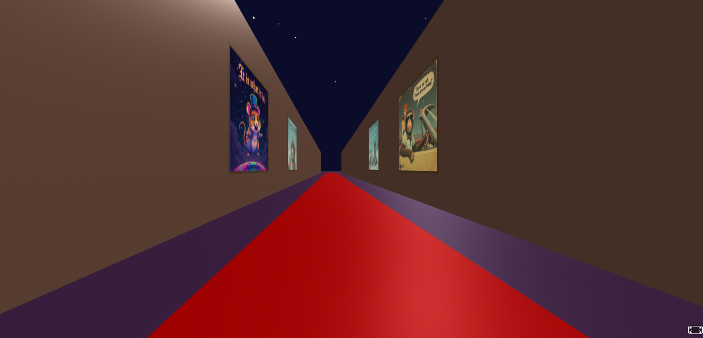
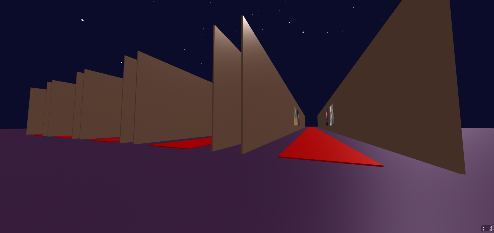

# VR Picture gallery on Node JS and A Frame
 
Automatically generates paintings on walls from the "images" directory, keeping relevant ratios of the images.

Built-in WASD control, for a virtual tour without a VR headset.

Create "images" directory and copy any images there _(jpe?g|png|gif)_.

```
 npm init -y
 npm install express image-size
 node server.js 
```





**P.S.:** If you find a bug or you have an idea for a feature to add, please consider dropping me a messages on Reddit (r/starlightrobotics or u/starlightrobotics).
